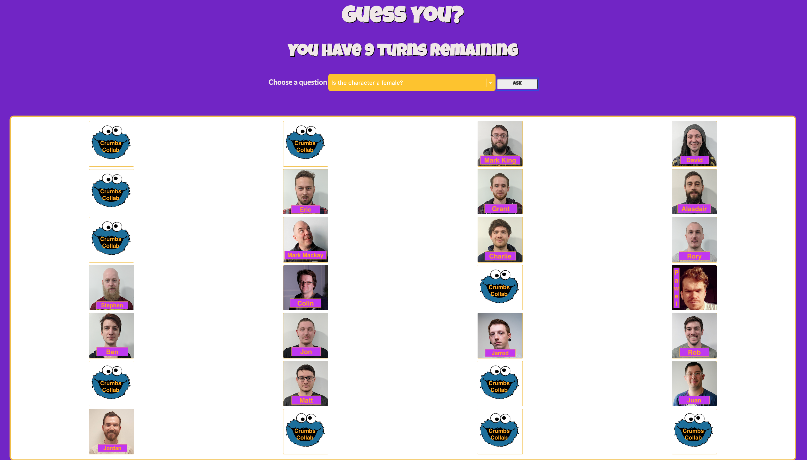

# Guess You?
https://guess-who-game.herokuapp.com/


This is a full-stack JavaScript web application game based on the boardgames 'Guess Who?' but instead it has been themed to be CodeClan instructors and E29 students 'Guess You?'.

##### Built With

The app was built with JavaScript as the main programming language, MongoDB and Express using PubSub pattern. 



## MVP

A user should be able to:

* View all characters cards.
* Select a question from a list. The selected question by the user will affect the character card view.
* View the result of the game.

## Extensions

A user should be able to:

* Have a turn time limit.
* Provide with some feedback after each selected question.
* View animation when card is out of play.
* Remove questions from the select dropdown after they have been asked.


## Advanced Extensions

The app should be:

* View score board of previous games.
* Have an option to select levels of difficulty.
* A multiplayer game.

## Getting Started

These instructions will get you a copy of the project up and running on your local machine for development and testing purposes.

### Prerequisites

Before starting, there are a few packages that are needed to be installed. First, npm init and npm install the followings:

* Webpack
* Express
* Mongodb

### Installing

First

```
npm init
```

Second, install Webpack is a static module bundler for modern JavaScript applications. Once it is installed, a config file is required.

```
npm install -D webpack webpack-cli
```

```
webpack.config.js
```

Third, install Express is a minimal and flexible Node.js web application framework that provides a set of features for web and mobile applications

```
npm install express --save

nnpm install --save-dev nodemon

npm install body-parser
```

Fourth, install MongoDB is an open-source, non-relational database. It was designed for storing huge amounts of non-relational data.

```
npm install mongodb
```

### Running

In order to make the app running, there are required to add some "scripts".

```
"build": "webpack -w"
```
This is for making the bundle.js in a watch mode.

```
"start": "node server.js"

"server:dev": "nodemon server/server.js"
```

This other one runs our server with Nodemon, so that it watches the file for changes and restarts the server as appropriate. In order to make it run, these are the commands you need to follow:

```
npm install

mongod
```
In a new tab, copy and paste the following to seed the database.

```
mongo < server/db/seeds.js
```

In a new tab, copy and paste the following to start running the bundler webpack watch mode

```
npm run build
```

And, finally, in a new tab, copy and paste the following to start running the server in the port <http://localhost:3000>

```
npm run server:dev
```


